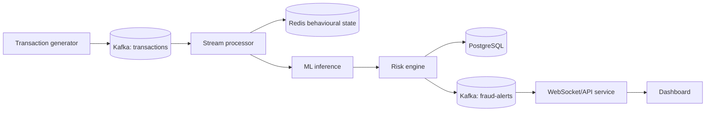

# Architecture

The first increment deliberately keeps generation independent of Kafka. This makes the event contract testable and provides deterministic JSONL fixtures before infrastructure is introduced.

